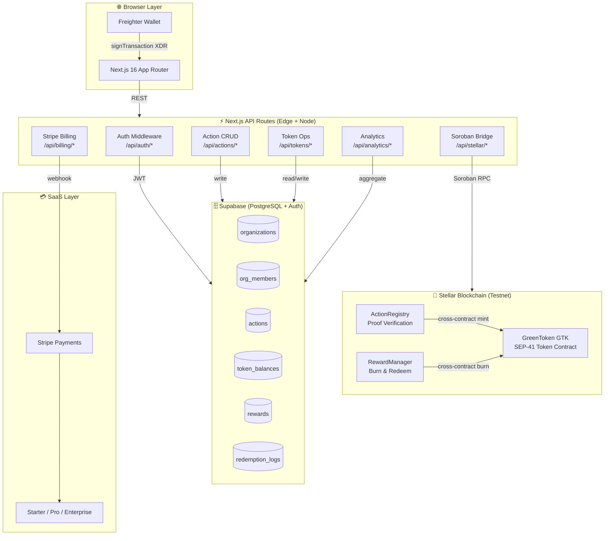

<div align="center">


# Community GreenToken

### Rewarding Sustainable Actions. Building Better Communities.

*A production-ready, multi-tenant SaaS platform that tokenizes real-world eco-actions into blockchain-verified rewards on Stellar.*

[](https://community-greentoken-fb803chx2-moracios-projects.vercel.app)
[](https://stellar.org)
[](https://github.com/stellar/stellar-protocol/blob/master/ecosystem/sep-0041.md)
[](https://nextjs.org)
[](https://typescriptlang.org)
[](https://supabase.com)
[](https://stripe.com)
[](LICENSE)

---

> **"The only Stellar hackathon project with a full SaaS layer: multi-tenant org management, Stripe billing, admin dashboards, Freighter wallet integration, and 3 live Soroban contracts — all shipped as a working product, not a proof of concept."**

</div>

---

## Why GreenToken Wins

| Capability | GreenToken | EcoLedger | ZeLoop | TikCoin | Green Earth |
|---|:---:|:---:|:---:|:---:|:---:|
| Live smart contracts on a public chain | ✅ Stellar | ❌ Never shipped | ✅ BSC (dead) | ❌ None | ❌ None |
| Admin-verified action proofs | ✅ On-chain hash | ❌ Mockup | ❌ None | ❌ None | ❌ Pledges only |
| Multi-tenant SaaS (any org can launch) | ✅ | ❌ | ❌ | ❌ | ❌ |
| Real token utility (redeem for goods) | ✅ | ❌ | ✅ (broken) | ❌ | ❌ |
| Live impact analytics dashboard | ✅ | ❌ | ❌ | ❌ | ❌ |
| Stripe SaaS billing (Starter/Pro tiers) | ✅ | ❌ | ❌ | ❌ | ❌ |
| Freighter wallet integration | ✅ | ❌ | ❌ | ❌ | ❌ |
| Gamified leaderboard | ✅ | ❌ | ❌ | ❌ | ❌ |
| Transaction fees < $0.001 | ✅ $0.000001 | N/A | ❌ $0.10–$2 | N/A | N/A |
| Carbon-neutral blockchain | ✅ | N/A | ❌ BSC PoA | N/A | N/A |

---

## What Is Community GreenToken?

Community GreenToken (GTK) is a **multi-tenant SaaS platform** that lets any organization — schools, municipalities, NGOs, corporations — launch a fully-branded, blockchain-verified sustainability reward program in minutes.

**The core loop:**

1. An organization signs up and deploys its reward program (no blockchain expertise required)
2. Members submit eco-actions (recycling, planting trees, carpooling) with photo proof
3. Org admins review and approve — approval triggers on-chain GTK minting via Soroban
4. Members redeem GTK for real rewards, or withdraw to their wallet

Every minted token is traceable to a verified real-world action. Every redemption burns GTK on-chain. No token exists without a reason.

---

## Live Resources

| Resource | URL |
|---|---|
| **Live App** | [community-greentoken.vercel.app](https://community-greentoken-fb803chx2-moracios-projects.vercel.app) |
| **Stellar Expert (Testnet)** | [stellar.expert/explorer/testnet](https://stellar.expert/explorer/testnet) |
| **Supabase Project** | `https://thjqzzsoptsdocnyoxcu.supabase.co` |
| **Stellar Laboratory** | [laboratory.stellar.org](https://laboratory.stellar.org/#?network=test) |

### Live Smart Contracts (Stellar Testnet)

| Contract | Role | Contract ID | Explorer |
|---|---|---|---|
| **GreenToken (GTK)** | SEP-41 token — mint, burn, transfer | `CCWB632FUW5RVXEZ424JI6HPC723FOVGX5Z2Z6DF4XZ7CEMLQB2U2JVH` | [View ↗](https://stellar.expert/explorer/testnet/contract/CCWB632FUW5RVXEZ424JI6HPC723FOVGX5Z2Z6DF4XZ7CEMLQB2U2JVH) |
| **ActionRegistry** | Records eco-actions with SHA-256 proof | `CBN5MHWIRHT4UKLAVVHOJC3MP5PNK7S2PCNWF4GOSEWVMUCORJOR2OMO` | [View ↗](https://stellar.expert/explorer/testnet/contract/CBN5MHWIRHT4UKLAVVHOJC3MP5PNK7S2PCNWF4GOSEWVMUCORJOR2OMO) |
| **RewardManager** | Burns GTK on redemption, manages reward catalog | `CCM6ELX6CBDNTHS2XNVQSLE4GQLPEHCYRHKWJCT6PCO55PD2U33FEJTR` | [View ↗](https://stellar.expert/explorer/testnet/contract/CCM6ELX6CBDNTHS2XNVQSLE4GQLPEHCYRHKWJCT6PCO55PD2U33FEJTR) |

**Admin Wallet (Testnet):** `GBUJUY43L6EVCKLPRNZUPUE7RO7MTFFTRUDXURJPE2SRE4K6X6KAT6HZ`

---

## System Architecture



---

## Economic Flywheel

```
        ┌──────────────────────────────────────┐
        │           ORG SIGNS UP               │
        │    Pays Starter/Pro via Stripe        │
        └──────────────┬───────────────────────┘
                       │
                       ▼
        ┌──────────────────────────────────────┐
        │         MEMBER SUBMITS ACTION         │
        │  Photo + description → SHA-256 hash   │
        └──────────────┬───────────────────────┘
                       │
                       ▼
        ┌──────────────────────────────────────┐
        │        ADMIN VERIFIES                │
        │   Approve → Soroban cross-contract   │
        │   ActionRegistry → GreenToken.mint() │
        └──────────────┬───────────────────────┘
                       │
                       ▼
        ┌──────────────────────────────────────┐
        │       GTK MINTED ON-CHAIN            │
        │  Immutable record on Stellar Testnet  │
        │  Balance visible in Freighter wallet  │
        └──────────────┬───────────────────────┘
                       │
                       ▼
        ┌──────────────────────────────────────┐
        │         MEMBER REDEEMS               │
        │  GTK burned via RewardManager        │
        │  Real reward delivered to member     │
        └──────────────┬───────────────────────┘
                       │
                       ▼
        ┌──────────────────────────────────────┐
        │    LEADERBOARD + ANALYTICS UPDATE    │
        │  Org sees impact metrics             │
        │  Members compete → more actions      │
        └──────────────┬───────────────────────┘
                       │
                  (loop repeats)
```

---

## Platform Features

### For Organizations

| Feature | Description | Status |
|---|---|:---:|
| **Org Setup Wizard** | 5-step onboarding: profile → token config → plan → deploy | ✅ Live |
| **Member Invite System** | Email + token-based invite links (`/join/[token]`) | ✅ Live |
| **Action Verification Queue** | Admin reviews pending actions, approve triggers on-chain mint | ✅ Live |
| **Reward Catalog** | Create custom rewards; members redeem GTK for them | ✅ Live |
| **Analytics Dashboard** | Actions verified, tokens distributed, CO₂ offset, member growth | ✅ Live |
| **Org Settings** | Logo, token name, reward rates, member permissions | ✅ Live |
| **Stripe Billing** | Starter (free) → Pro ($49/mo) → Enterprise (custom) | ✅ Live |
| **Upgrade/Downgrade** | Plan changes via Stripe Customer Portal | ✅ Live |

### For Members

| Feature | Description | Status |
|---|---|:---:|
| **Action Submission** | Photo proof + category → submitted for admin review | ✅ Live |
| **GTK Wallet** | On-chain balance, synced with Freighter | ✅ Live |
| **Token History** | Full mint + redemption log | ✅ Live |
| **Leaderboard** | Global + org-level rankings by GTK earned | ✅ Live |
| **Redeem Rewards** | Browse org reward catalog, burn GTK for goods | ✅ Live |
| **Donations** | Allocate GTK to eco-projects | ✅ Live |
| **Withdrawal** | Request GTK payout | ✅ Live |
| **Freighter Login** | Connect Stellar wallet for signed redemptions | ✅ Live |

---

## Tech Stack

### Blockchain Layer
| Component | Technology | Version |
|---|---|---|
| Smart Contracts | Rust (Soroban SDK) | soroban-sdk 22 |
| Token Standard | SEP-41 | Latest |
| Wallet Integration | Freighter API | 3.0.0 |
| Stellar JS SDK | @stellar/stellar-sdk | 13.1.0 |
| Network | Stellar Testnet / Soroban RPC | - |

### Application Layer
| Component | Technology | Version |
|---|---|---|
| Framework | Next.js (App Router) | 16.2.7 |
| Language | TypeScript | 5.x |
| Styling | Tailwind CSS | 4.x |
| Icons | Material Design SVGs | Custom factory |
| Charts | Recharts | 2.x |
| Validation | Zod | 3.24.4 |
| Date Utils | date-fns | 4.1.0 |

### Infrastructure Layer
| Component | Technology | Notes |
|---|---|---|
| Database | Supabase (PostgreSQL) | 13 tables, RLS enabled |
| Auth | Supabase Auth | JWT + session middleware |
| File Storage | Supabase Storage | Action photo evidence |
| Payments | Stripe | Webhooks + Customer Portal |
| Deployment | Vercel | Edge + Node.js runtime |
| Testing | Jest | Unit + integration |

---

## Project Structure

```
Community-GreenToken/
│
├── app/                          # Next.js 16 App Router (pages + API)
│   ├── page.tsx                  # Landing page
│   ├── layout.tsx                # Root layout — Poppins font, UserProvider
│   │
│   ├── signin/page.tsx           # Sign in — full-screen hero card
│   ├── signup/page.tsx           # Sign up — split hero/form layout
│   ├── join/[token]/page.tsx     # Org invite link handler
│   │
│   ├── dashboard/page.tsx        # User home — balance, actions, leaderboard
│   ├── profile/page.tsx          # Profile management
│   ├── submit-action/page.tsx    # Eco-action submission form
│   ├── leaderboard/page.tsx      # Community rankings
│   ├── redeem/page.tsx           # Reward redemption UI
│   ├── withdraw/page.tsx         # Token withdrawal
│   ├── donations/page.tsx        # Eco-project donations
│   ├── analytics/page.tsx        # Impact metrics
│   ├── tokenomics/page.tsx       # GTK tokenomics (public, investor-facing)
│   │
│   ├── org/
│   │   ├── setup/page.tsx        # 5-step org creation wizard
│   │   └── admin/                # Org admin panel
│   │       ├── page.tsx          # Overview
│   │       ├── members/page.tsx  # Member management
│   │       ├── actions/page.tsx  # Pending action queue
│   │       ├── billing/page.tsx  # Stripe billing
│   │       └── settings/page.tsx # Org settings
│   │
│   ├── admin/page.tsx            # Super admin panel (platform-wide)
│   │
│   ├── how-it-works/             # Public marketing pages
│   ├── impact/
│   ├── about/
│   ├── pricing/
│   ├── terms/
│   └── privacy/
│   │
│   └── api/                      # 38 API routes
│       ├── auth/                 # signup, signin, signout, me, superadmin
│       ├── actions/              # submit, pending, verify, CRUD
│       ├── tokens/               # balance, history
│       ├── redeem/               # redeem, history
│       ├── rewards/              # catalog, [id]
│       ├── leaderboard/          # rankings, /me
│       ├── donations/            # projects, history
│       ├── orgs/                 # create, [id], check-slug
│       ├── invites/              # create, email, [token]
│       ├── billing/              # plans, checkout, portal, status, webhook
│       ├── admin/                # orgs, billing-events, metrics
│       ├── analytics/            # overview, actions, members, tokens
│       ├── stellar/              # Soroban RPC bridge
│       └── withdraw/             # withdrawal requests
│
├── components/                   # Shared React components
│   ├── layouts/
│   │   ├── AppLayout.tsx         # Authenticated app shell + sidebar
│   │   ├── OrgAdminLayout.tsx    # Org admin shell
│   │   └── PublicLayout.tsx      # Navbar + footer wrapper
│   ├── landing/                  # Landing page sections
│   │   ├── HeroSection.tsx       # Full-width background hero
│   │   ├── FeaturesGrid.tsx
│   │   ├── HowItWorks.tsx
│   │   ├── CompetitiveEdge.tsx   # vs. competitors
│   │   └── StatsRow.tsx
│   ├── dashboard/                # Dashboard widgets
│   ├── org/                      # Org-specific components
│   ├── stellar/                  # FreighterConnect, TokenBalance
│   ├── ui/                       # Button, Toast, Modal, UserMenu
│   ├── icons/index.tsx           # Material Design SVG icon factory
│   ├── Navbar.tsx
│   ├── Sidebar.tsx
│   └── Footer.tsx
│
├── lib/                          # Server-safe utilities
│   ├── stellar/                  # Stellar SDK service layer
│   │   ├── config.ts             # Network config, contract IDs
│   │   ├── client.ts             # Soroban RPC client
│   │   ├── freighter.ts          # Wallet signing helpers
│   │   └── contracts/
│   │       ├── green-token.ts    # GTK contract wrapper
│   │       ├── action-registry.ts
│   │       └── reward-manager.ts
│   ├── supabase/
│   │   ├── client.ts             # Browser Supabase client
│   │   └── server.ts             # Server Supabase client
│   ├── middleware/               # Auth, admin guard, plan gate, rate limiter
│   ├── validation/schemas.ts     # All Zod schemas
│   └── utils.ts                  # cn(), formatGTK(), etc.
│
├── hooks/                        # Custom React hooks
│   ├── useGreenToken.ts          # Token balance + tx ops
│   ├── useStellarWallet.ts       # Freighter connection
│   ├── useOrg.ts                 # Org context
│   ├── usePlan.ts                # Subscription plan
│   └── useUser.ts                # Auth context
│
├── contracts/                    # Soroban smart contracts (Rust)
│   ├── green_token/src/lib.rs    # SEP-41 GTK token
│   ├── action_registry/src/lib.rs
│   ├── reward_manager/src/lib.rs
│   └── Cargo.toml                # Rust workspace
│
├── database/migrations/          # 23 SQL migrations (Supabase)
│   ├── 001_create_organizations.sql
│   ├── 002_create_org_members.sql
│   ├── 005_create_actions.sql
│   ├── 006_create_token_balances.sql
│   ├── 013_enable_rls_policies.sql
│   └── [18 more migrations]
│
├── architecture/                 # Technical documentation (16 .md files)
├── providers/UserProvider.tsx    # Global Supabase auth subscription
├── proxy.ts                      # Next.js Edge Middleware (auth guard)
├── .env.example                  # All required environment variables
└── package.json
```

---

## Quick Start

### Prerequisites

```bash
# Node.js 18+
node --version  # must be >= 18

# Rust + Soroban CLI
rustup target add wasm32-unknown-unknown
cargo install --locked stellar-cli --features opt

# Freighter browser extension → https://freighter.app
```

### 1 — Clone & Install

```bash
git clone https://github.com/mokwathedeveloper/Community-GreenToken.git
cd Community-GreenToken
npm install
```

### 2 — Configure Environment

```bash
cp .env.example .env.local
# Open .env.local and fill in the values from the table below
```

### 3 — Set Up Supabase

1. Create a project at [supabase.com](https://supabase.com)
2. Run all migrations in order:

```bash
# In Supabase SQL Editor, run each file in database/migrations/ in order
# 001 → 002 → ... → 023
```

### 4 — Deploy Smart Contracts (Testnet)

```bash
# Build all three Soroban contracts
cd contracts
stellar contract build

# Deploy to testnet (requires funded admin account)
stellar contract deploy \
  --wasm target/wasm32-unknown-unknown/release/green_token.wasm \
  --network testnet \
  --source STELLAR_ADMIN_SECRET_KEY

# Repeat for action_registry and reward_manager
# Copy the printed contract IDs into .env.local
```

> **Shortcut:** The contracts are already deployed on testnet at the addresses in [Live Resources](#live-resources). Copy those IDs into `.env.local` to skip this step.

### 5 — Run the App

```bash
npm run dev
# Frontend: http://localhost:3000
```

### 6 — Test the Full Demo Flow

```bash
# 1. Open http://localhost:3000/org/setup → create an organization
# 2. Invite a test member via /org/admin/members → copy invite link
# 3. Sign up as that member (open invite link in incognito)
# 4. Member: submit an action at /submit-action (upload any image)
# 5. Admin: approve the action at /org/admin/actions
# 6. Member: watch GTK balance update at /dashboard
# 7. Member: redeem tokens at /redeem
# 8. Verify transaction at https://stellar.expert/explorer/testnet
```

---

## Environment Variables

### Stellar Network

| Variable | Description | Example |
|---|---|---|
| `NEXT_PUBLIC_STELLAR_NETWORK` | Network selection | `testnet` |
| `NEXT_PUBLIC_HORIZON_URL` | Horizon API | `https://horizon-testnet.stellar.org` |
| `NEXT_PUBLIC_SOROBAN_RPC_URL` | Soroban RPC | `https://soroban-testnet.stellar.org` |
| `NEXT_PUBLIC_NETWORK_PASSPHRASE` | Network passphrase | `Test SDF Network ; September 2015` |

### Smart Contracts

| Variable | Description |
|---|---|
| `NEXT_PUBLIC_GREEN_TOKEN_CONTRACT_ID` | GTK SEP-41 token contract |
| `NEXT_PUBLIC_ACTION_REGISTRY_CONTRACT_ID` | Action verification contract |
| `NEXT_PUBLIC_REWARD_MANAGER_CONTRACT_ID` | Token redemption contract |

### Admin Wallet (Server-Only — Never Expose)

| Variable | Description |
|---|---|
| `STELLAR_ADMIN_PUBLIC_KEY` | Platform admin public key |
| `STELLAR_ADMIN_SECRET_KEY` | Platform admin secret key — server-side only |

### Supabase

| Variable | Description |
|---|---|
| `NEXT_PUBLIC_SUPABASE_URL` | Project URL |
| `NEXT_PUBLIC_SUPABASE_ANON_KEY` | Public anon key |
| `SUPABASE_SERVICE_ROLE_KEY` | Service role key — server-side only |

### Stripe

| Variable | Description |
|---|---|
| `STRIPE_SECRET_KEY` | Stripe secret key |
| `NEXT_PUBLIC_STRIPE_PUBLISHABLE_KEY` | Publishable key |
| `STRIPE_WEBHOOK_SECRET` | Webhook signing secret |
| `STRIPE_STARTER_PRICE_ID` | Price ID for Starter plan |
| `STRIPE_PRO_PRICE_ID` | Price ID for Pro plan |

### App

| Variable | Description | Example |
|---|---|---|
| `NEXT_PUBLIC_APP_DOMAIN` | Production domain | `greentoken.app` |
| `NEXT_PUBLIC_APP_URL` | Full app URL | `https://greentoken.app` |

---

## API Reference

### Authentication — `/api/auth/`

| Method | Route | Description | Auth Required |
|---|---|---|:---:|
| `POST` | `/api/auth/signup` | Register new user + role assignment | No |
| `POST` | `/api/auth/signin` | Sign in, return session | No |
| `POST` | `/api/auth/signout` | Invalidate session | Yes |
| `GET` | `/api/auth/me` | Current user + org + role | Yes |
| `GET` | `/api/auth/superadmin-exists` | Check if platform admin exists | No |
| `POST` | `/api/auth/set-superadmin` | Assign superadmin role (one-time) | Yes |

### Actions — `/api/actions/`

| Method | Route | Description | Auth Required |
|---|---|---|:---:|
| `POST` | `/api/actions/submit` | Submit eco-action with evidence | Member |
| `GET` | `/api/actions/pending` | List pending actions for org | Admin |
| `POST` | `/api/actions/verify` | Approve action → mint GTK on-chain | Admin |
| `GET` | `/api/actions/` | List user's own actions | Member |

### Tokens — `/api/tokens/`

| Method | Route | Description |
|---|---|---|
| `GET` | `/api/tokens/balance` | On-chain GTK balance for current user |
| `GET` | `/api/tokens/history` | Full mint + transfer history |

### Leaderboard — `/api/leaderboard/`

| Method | Route | Description |
|---|---|---|
| `GET` | `/api/leaderboard/` | Top members by GTK earned (org-scoped) |
| `GET` | `/api/leaderboard/me` | Caller's rank and score |

### Billing — `/api/billing/`

| Method | Route | Description |
|---|---|---|
| `GET` | `/api/billing/plans` | Available subscription plans |
| `POST` | `/api/billing/create-checkout` | Stripe Checkout session → redirect |
| `POST` | `/api/billing/portal` | Stripe Customer Portal → redirect |
| `GET` | `/api/billing/status` | Current org plan + renewal date |
| `POST` | `/api/billing/webhook` | Stripe webhook handler (signed) |

### Analytics — `/api/analytics/`

| Method | Route | Description |
|---|---|---|
| `GET` | `/api/analytics/overview` | KPIs: actions, tokens, members, CO₂ |
| `GET` | `/api/analytics/actions` | Time-series action data |
| `GET` | `/api/analytics/members` | Member growth and activity |
| `GET` | `/api/analytics/tokens` | Token mint, burn, circulation |

*Full API documentation: [`architecture/api_endpoints.md`](architecture/api_endpoints.md)*

---

## Database Schema

13 tables with Row-Level Security (RLS) policies. All user data is org-scoped.

```
organizations ──┬── org_members ──── users
                │         │
                │         └── actions ── token_balances
                │                   └── redemption_logs
                │
                ├── invites
                ├── rewards
                ├── leaderboard (cached)
                ├── analytics (aggregated)
                ├── donations
                ├── billing_events
                └── withdrawal_requests
```

| Table | Purpose | Key Columns |
|---|---|---|
| `organizations` | Multi-tenant root | `id`, `name`, `slug`, `plan`, `stripe_customer_id` |
| `org_members` | User ↔ org relationship | `user_id`, `org_id`, `role` (owner/admin/member) |
| `invites` | Invite tokens | `token`, `org_id`, `expires_at`, `used_at` |
| `actions` | Eco-action submissions | `evidence_hash`, `status`, `action_type`, `org_id` |
| `token_balances` | GTK balances | `user_id`, `org_id`, `balance`, `last_synced_at` |
| `redemption_logs` | Burn history | `user_id`, `reward_id`, `gtk_burned`, `tx_hash` |
| `rewards` | Org reward catalog | `org_id`, `name`, `gtk_cost`, `stock` |
| `leaderboard` | Cached rankings | `user_id`, `org_id`, `total_gtk`, `rank` |
| `donations` | Eco-project allocations | `user_id`, `project`, `gtk_amount` |
| `billing_events` | Stripe events | `event_type`, `stripe_event_id`, `org_id` |
| `withdrawal_requests` | Payout requests | `user_id`, `amount`, `status`, `wallet_address` |

*Full schema: [`architecture/database_design_plan.md`](architecture/database_design_plan.md)*

---

## Smart Contracts

### GreenToken.rs — SEP-41 Token

The main GTK token contract, fully compliant with [Stellar SEP-41](https://github.com/stellar/stellar-protocol/blob/master/ecosystem/sep-0041.md).

```rust
// Core interface
fn mint(env: Env, to: Address, amount: i128);           // Admin-only
fn burn(env: Env, from: Address, amount: i128);         // Called by RewardManager
fn transfer(env: Env, from: Address, to: Address, amount: i128);
fn balance(env: Env, id: Address) -> i128;
fn approve(env: Env, from: Address, spender: Address, amount: i128, expiration_ledger: u32);
```

Key properties:
- **Admin-only minting** — GTK is only created for verified real-world actions
- **7 decimal places** — Stellar standard for precision
- **Cross-contract callable** — ActionRegistry invokes `mint()` directly
- **On-chain events** — every state change emits an event

### ActionRegistry.rs — Eco-Action Verification

Records action submissions and triggers token minting on admin approval.

```rust
fn register_action(env: Env, submitter: Address, evidence_hash: BytesN<32>, action_type: u32) -> u64;
fn verify_action(env: Env, action_id: u64, verifier: Address) -> bool;  // calls GTK.mint()
fn get_action_types(env: Env) -> Vec<ActionType>;
fn get_action(env: Env, action_id: u64) -> ActionRecord;
```

Key properties:
- **SHA-256 evidence hashing** — duplicate evidence rejected on-chain
- **10 configurable action types** — recycling, planting, carpooling, etc.
- **Cross-contract mint** — `verify_action()` calls `GreenToken.mint()` atomically

### RewardManager.rs — Token Redemption

Manages the reward catalog and handles GTK burning on redemption.

```rust
fn create_reward(env: Env, org_id: u64, name: String, gtk_cost: i128, stock: u32) -> u64;
fn redeem(env: Env, user: Address, reward_id: u64) -> bool;  // calls GTK.burn()
fn get_redemption_history(env: Env, user: Address) -> Vec<RedemptionRecord>;
```

Key properties:
- **User-signed transactions** — platform never controls user wallets
- **Atomic burn-on-redeem** — GTK is destroyed in the same transaction as reward delivery
- **Deflationary mechanics** — total GTK supply decreases with every redemption

---

## SaaS Pricing

| Feature | Starter | Pro | Enterprise |
|---|:---:|:---:|:---:|
| Price | Free | $49/month | Custom |
| Members | Up to 25 | Up to 500 | Unlimited |
| Actions / month | 100 | 5,000 | Unlimited |
| Custom rewards | 5 | Unlimited | Unlimited |
| Analytics | Basic | Advanced | Custom |
| Stripe billing | — | ✅ | ✅ |
| Priority support | — | ✅ | ✅ + SLA |
| Custom domain | — | — | ✅ |

Plan enforcement is handled server-side by `lib/middleware/planGate.ts` and verified on every API call. Upgrades/downgrades go through the Stripe Customer Portal — no manual intervention.

---

## Data Flow: Action → Token

```
Member Browser           API Layer              Blockchain
─────────────────────────────────────────────────────────
POST /submit-action  →  Hash evidence SHA-256
                        Write to actions table
                        Status: pending
                        ↓
                        [Admin reviews in /org/admin/actions]
                        ↓
POST /actions/verify →  Validate admin role
                        Mark action: verified
                                    ──────────────────────→
                                    ActionRegistry.verify_action(
                                      action_id,
                                      submitter_address
                                    )
                                    ↓ cross-contract call
                                    GreenToken.mint(
                                      submitter,
                                      reward_amount
                                    )
                                    ←──────────────────────
                        Sync balance to Supabase
                        Emit dashboard notification
GET /tokens/balance  ←  Return updated GTK balance
```

---

## Roadmap

| Phase | Feature | Status |
|---|---|:---:|
| **Phase 1 — Core** | Stellar contracts + GTK minting | ✅ Complete |
| **Phase 1 — Core** | Multi-tenant org management | ✅ Complete |
| **Phase 1 — Core** | Action submission + admin verification | ✅ Complete |
| **Phase 1 — Core** | Token redemption (Freighter-signed) | ✅ Complete |
| **Phase 2 — SaaS** | Stripe billing + plan enforcement | ✅ Complete |
| **Phase 2 — SaaS** | Analytics dashboards | ✅ Complete |
| **Phase 2 — SaaS** | Leaderboard + gamification | ✅ Complete |
| **Phase 2 — SaaS** | Competitive edge landing section | ✅ Complete |
| **Phase 2 — SaaS** | Tokenomics investor page | ✅ Complete |
| **Phase 3 — Growth** | QR code action verification | 🔄 Planned |
| **Phase 3 — Growth** | IoT sensor integration (automatic actions) | 🔄 Planned |
| **Phase 3 — Growth** | M-Pesa withdrawal (KES/USD off-ramp) | 🔄 Planned |
| **Phase 3 — Growth** | Mobile app (React Native) | 🔄 Planned |
| **Phase 4 — Scale** | Stellar Mainnet deployment | 🔄 Planned |
| **Phase 4 — Scale** | Multi-currency reward redemption | 🔄 Planned |
| **Phase 4 — Scale** | Carbon credit NFT certificates | 🔄 Planned |

---

## Troubleshooting

### "Freighter wallet not detected"

```bash
# Ensure Freighter is installed and unlocked
# Set Freighter to Testnet: Settings → Network → Testnet
# Refresh page after connecting
```

### "Contract invocation failed"

```bash
# Check RPC endpoint in .env.local
NEXT_PUBLIC_SOROBAN_RPC_URL=https://soroban-testnet.stellar.org

# Verify admin wallet is funded
stellar account show --network testnet GBUJUY43L6EVCKLPRNZUPUE7RO7MTFFTRUDXURJPE2SRE4K6X6KAT6HZ

# Fund if needed
curl "https://friendbot.stellar.org?addr=YOUR_PUBLIC_KEY"
```

### "Supabase 401 on org_members query"

```bash
# RLS policies must be applied — run migration 013
# In Supabase SQL Editor:
\i database/migrations/013_enable_rls_policies.sql
```

### "Stripe webhook returns 400"

```bash
# Webhook secret must match — re-run:
stripe listen --forward-to localhost:3000/api/billing/webhook
# Copy the printed signing secret to STRIPE_WEBHOOK_SECRET
```

### "Build fails: module not found"

```bash
rm -rf .next node_modules
npm install
npm run build
```

---

## Architecture Documentation

The `/architecture` folder contains 16 technical reference documents:

| Document | Contents |
|---|---|
| [`stellar_blockchain_architecture.md`](architecture/stellar_blockchain_architecture.md) | Full Stellar/Soroban system design, sequence diagrams |
| [`stellar_sdk_api_spec.md`](architecture/stellar_sdk_api_spec.md) | Every SDK function signature with types |
| [`stellar_implementation_rules.md`](architecture/stellar_implementation_rules.md) | Strict blockchain coding rules |
| [`api_endpoints.md`](architecture/api_endpoints.md) | All 38 API routes with request/response schemas |
| [`database_design_plan.md`](architecture/database_design_plan.md) | Full schema, indexes, RLS policies |
| [`backend_architecture.md`](architecture/backend_architecture.md) | API route structure, middleware chain |
| [`frontend_architecture.md`](architecture/frontend_architecture.md) | Component hierarchy, state management |
| [`security_checklist.md`](architecture/security_checklist.md) | Auth, RLS, rate limiting, input validation |
| [`performance_scaling.md`](architecture/performance_scaling.md) | Caching strategy, DB indexes, edge runtime |
| [`deployment_plan.md`](architecture/deployment_plan.md) | Testnet → Mainnet migration checklist |
| [`ai_analytics_integration.md`](architecture/ai_analytics_integration.md) | Analytics ML pipeline design |
| [`qr_iot_verification_md_full.md`](architecture/qr_iot_verification_md_full.md) | QR + IoT action verification design |
| [`error_logging_monitoring.md`](architecture/error_logging_monitoring.md) | Observability stack |
| [`blockchain_implementation_md.md`](architecture/blockchain_implementation_md.md) | Contract interaction patterns |

---

## Hackathon — WebBridge Stellar Track

**GreenToken was built specifically for the WebBridge Hackathon Stellar Track.**

### Stellar Implementation Checklist

- [x] 3 Soroban smart contracts deployed on Stellar Testnet
- [x] Full SEP-41 token standard compliance
- [x] Freighter wallet browser integration
- [x] Cross-contract calls: `ActionRegistry.verify_action()` → `GreenToken.mint()`
- [x] SHA-256 evidence hash stored on-chain — duplicate-proof action verification
- [x] User-signed redemptions via Freighter — platform never controls wallets
- [x] Deflationary token mechanics — GTK burned on every redemption
- [x] All contracts viewable on Stellar Expert Testnet Explorer
- [x] Ultra-low fees: $0.000001 per transaction (vs. BSC $0.10–$2)
- [x] Carbon-neutral chain — aligned with the eco mission

### Why We Beat Competitors on Stellar

> EcoLedger planned Soroban contracts but never shipped them.
> ZeLoop used BSC — fees made micro-rewards uneconomic and the token lost 99.8% of its value.
> **We built on Stellar from day one.** The fee structure is the product.

---

## Contributing

```bash
# Fork → clone → branch
git checkout -b feature/your-feature

# Make changes, run type check
npx tsc --noEmit

# Test
npm run test

# Commit (no --no-verify, no skipping hooks)
git commit -m "feat(scope): description"

# Open a PR against main
```

**Code standards:** See [`DEVELOPMENT_RULES.md`](DEVELOPMENT_RULES.md)

---

## License

MIT © 2025 Community GreenToken Contributors

---

<div align="center">

Built with dedication for a greener tomorrow, powered by Stellar.

[Live Demo](https://community-greentoken-fb803chx2-moracios-projects.vercel.app) · [Tokenomics](https://community-greentoken-fb803chx2-moracios-projects.vercel.app/tokenomics) · [Stellar Expert](https://stellar.expert/explorer/testnet) · [Report Issue](https://github.com/mokwathedeveloper/Community-GreenToken/issues)

**#StellarBlockchain #GreenToken #WebBridgeHackathon #Soroban #SustainabilityTech**

</div>
